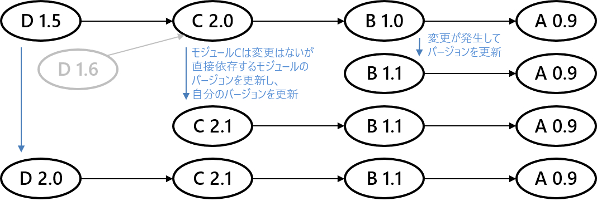
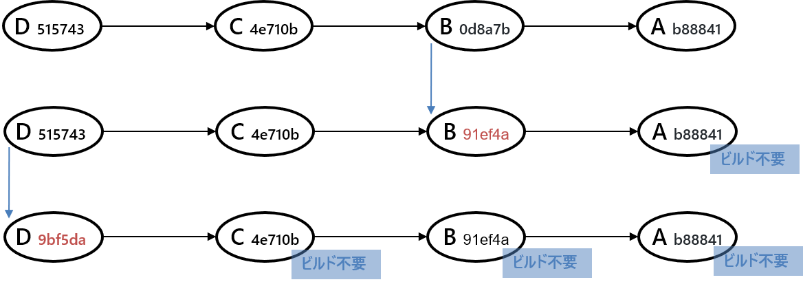

## 概要

複数のモジュールに依存関係がある。
モジュールはGitレポジトリのようなものとする。

ここで、モジュールA, B, C, Dがあって、
Aをビルドしてインストールしたあと、
Bをビルドしてインストールし、
そのあと同様にC、Dと続けることで、
モジュール全体のビルドが完成する例を考える。

BからAに伸びる矢印はBがAに依存していることを表す。
文章中では`B -> A`と表す。

特に、モジュール間の依存関係を記述しない場合、
各モジュールの最新バージョンをビルドすることで、
モジュール全体の最新を入手できるとする。

世の中的には、このような蛮行は無くなりつつあり、
パッケージ管理システムが横行している。

例えば、Bのバージョンが更新されても、Cは相変わらず
Bの以前のバージョンを使用可能である。
Cは何も変更が無いものの、
依存しているモジュールを更新して、
自分のモジュールバージョンを更新することももちろんできる。
このようにパッケージで管理されている場合、
どのモジュールもバージョン毎に一回だけビルドされればよく、
初回以外はビルド済みのバイナリパッケージを適用することで、
再ビルドを回避できる。

では、パッケージ管理システムという概念を取り入れず、
つまりモジュール間の依存関係を記述しないで、
不要なビルドを無くすことはできないだろうか。

まずBが更新されたとき、Bが直接的または間接的に
依存している全モジュール（この例ではAだけ）に変更がなければ、
それらの前回ビルドの結果をそのまま用いることができる。
つまり、ビルド後にzipでもtarでもいいから、
何かまとめて保存しておけば、
それを使ってビルドをスキップできる。
しかし、CとDは、自分たちには変更がないものの、
直接的または間接的に依存しているBが変更されているため、
再ビルドが必要となる。

さらに、その後でDが変更された場合、
Dが直接的または間接的に
依存している全モジュール（この例ではA, B, C）に変更が無いため、
それらの前回のビルドをそのまま使ってよい。

したがって、仮説は次のようになる:

> モジュールをビルドするときに、
自分のモジュールが直接的または間接的に依存している全モジュールと、
その各バージョンの組み合わせを追跡すること、
および自分のビルド結果を依存する全モジュールのシグネチャと共に保存することで、
不要なビルドを無くすことができる。
